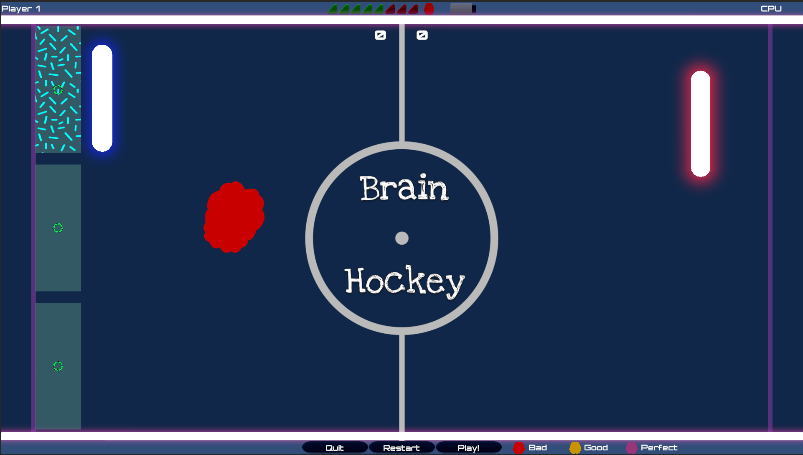

# BrainHockey

Welcome to BrainHockey, a mind-bending twist on the classic arcade game Pong! Get ready to experience the future of gaming with brain-computer interface (BCI) technology from g.tec.

## What is BrainHockey?

BrainHockey is an innovative take on the beloved Pong game, where players use their brainpower to control the paddle instead of traditional keyboard or mouse inputs. Powered by g.tec Unicorn devices, BrainHockey taps into the potential of BCI technology, allowing players to move their paddle simply by focusing and concentrating on the Neurofeedback Targets.

## How to Play

1. **Download**: get the folder "BrainHockey.zip" from the  and run the executable.
2. **Get Set Up**: Connect your g.tec Unicorn device and ensure it's properly calibrated on your brain.
3. **Focus and Concentrate**: Use your mental focus on the Neurofeedback Targets to control the paddle's movement.
4. **Compete or Collaborate**: Play against friends in multiplayer mode or challenge yourself in single-player mode.
5. **Score Points**: Keep your eye on the puck and deflect it past your opponent's paddle to score points.

## Coding Exercise
This project is part of a tutorial series to learn how to integrate a BCI into a videogame.
On the branch `coding-exercise` is possible to find a "vanilla" version of the game with only standard keyboard input and no UI.
(Coming soon!) The implementation of the neurogame step-by-step can be found on YouTube.

## Features

- **BCI Integration**: Control the paddle using your brain waves with g.tec Unicorn devices.
- **Classic Gameplay**: Experience the timeless fun of Pong with a futuristic twist.
- **Single Player and Multiplayer Modes**: Test your skills against the computer or challenge friends in local multiplayer matches.
- **Customizable Difficulty**: Adjust the game settings to match your skill level and preferences.

## Requirements to play

- g.tec Unicorn device
- Windows

## Requirements to develop
- gtec Unicorn device
- Unity 2022.3.11f or above (other versions are untested)
- Unicorn Unity Interface

## Get Started

Ready to enter the world of BrainHockey? Clone or download the repository, follow the setup instructions, and start playing today!

## Feedback and Contributions

We welcome feedback, suggestions, and contributions from the community. If you have ideas for improvements or new features, feel free to open an issue or submit a pull request.

Let's revolutionize gaming together with BCI technology. Are you ready to unlock the power of your mind? Let's play! 🧠🏒

## Acknowledgments
This game is free to play and customize for non-commercial use. If you use any parts of this game in your research, please cite the original authors.

Music by <a href="https://pixabay.com/users/grand_project-19033897/?utm_source=link-attribution&utm_medium=referral&utm_campaign=music&utm_content=133094">Grand_Project</a> from <a href="https://pixabay.com//?utm_source=link-attribution&utm_medium=referral&utm_campaign=music&utm_content=133094">Pixabay</a>
